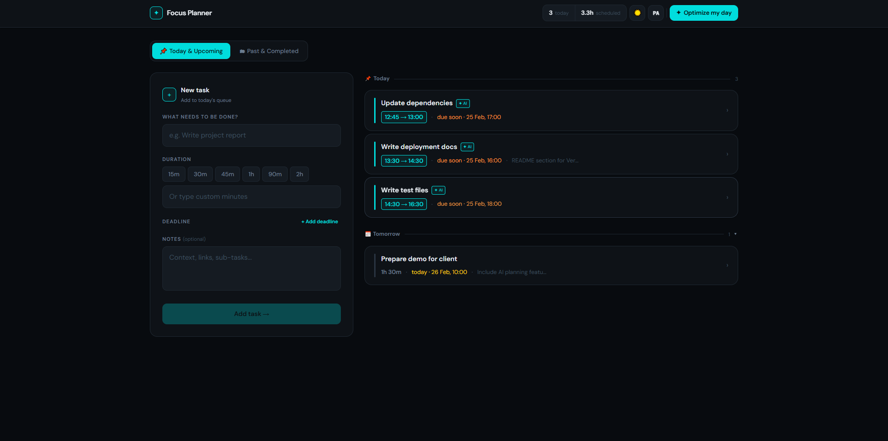

# AI Focus Planner

> Intelligent task management that schedules your day - not just lists it.


<!-- Replace with your actual screenshot -->

**Live Demo:** https://ai-focus-planner-iota.vercel.app/

---

## What it does

AI Focus Planner is a task management app that goes one step further than a to-do list. You add your tasks with time estimates and deadlines, then hit **"Optimize my day"** - the app calls GPT-4o-mini, which analyzes your workload and returns a concrete time-blocked schedule starting from the current moment.

You can accept the AI plan (tasks reorder and display their assigned time slots) or discard it and keep your original list. Completed tasks move to a separate "Past & Completed" view so your active queue stays clean.

---

## Tech Stack

| Layer | Technology |
|-------|-----------|
| Frontend | React 19 + TypeScript + Vite |
| Styling | CSS Variables + Tailwind CSS |
| Database | Supabase (PostgreSQL + RLS) |
| Auth | Supabase Auth (email/password + Google OAuth) |
| AI | OpenAI GPT-4o-mini via Vercel serverless function |
| Deployment | Vercel |

---

## LLMs & Tools Used

| Tool | How I used it |
|------|--------------|
| **Claude (Anthropic)** | Primary development assistant - component architecture, business logic, prompt engineering, bug fixing |
| **Claude Code** | In-editor assistant for refactoring and iterative fixes |
| **OpenAI GPT-4o-mini** | The AI model that runs inside the app to generate daily schedules |

---

## The Hallucination Problem

**The issue:** GPT-4o-mini was expected to return pure JSON; however, in a significant number of cases, responses were wrapped in markdown code fences (` ```json `) or prefixed with explanatory text. This caused `JSON.parse()` to throw, breaking the optimization flow.

**How I solved it — in three steps:**

**1. Prompt engineering first.** I made the system prompt explicit and repeated:

```
You must respond ONLY with valid JSON - no explanation, no markdown, no extra text.
```

This alone dropped the failure rate significantly, but not to zero.

**2. Defensive parsing as a safety net.** I wrote a `safeParseJson()` utility that strips markdown artifacts before parsing:

```typescript
export function safeParseJson(text: string) {
  try {
    const clean = text.replace(/```json\n?/g, '').replace(/```\n?/g, '').trim()
    return JSON.parse(clean)
  } catch {
    return null
  }
}
```

**3. Runtime schema validation.** Even after parsing, I validate that the required fields exist before returning to the client:

```typescript
if (!parsed?.ordered_task_ids || !parsed?.slots || !parsed?.rationale) {
  return res.status(500).json({ error: 'Invalid response from AI. Please try again.' })
}
```

The key insight was treating LLM output like any untrusted external API - parse defensively, validate the shape, and fail gracefully with a user-friendly message rather than a silent crash.

---

## Setup Locally

**1. Clone the repo**
```bash
git clone https://github.com/yourusername/ai-focus-planner.git
cd ai-focus-planner
```

**2. Install dependencies**
```bash
npm install
```

**3. Create a Supabase project** at [supabase.com](https://supabase.com) and run this SQL:

```sql
create table tasks (
  id uuid default gen_random_uuid() primary key,
  user_id uuid default auth.uid() not null,
  title text not null,
  estimate_minutes integer not null,
  deadline timestamp with time zone,
  notes text,
  ai_plan jsonb,
  completed boolean default false,
  sort_order integer default 0,
  created_at timestamp with time zone default now()
);

alter table tasks enable row level security;

create policy "Users can only access their own tasks"
  on tasks for all using (auth.uid() = user_id);
```

**4. Set environment variables** - copy `.env.example` to `.env`:

```env
VITE_SUPABASE_URL=your_supabase_url
VITE_SUPABASE_PUBLISHABLE_KEY=your_supabase_anon_key
SUPABASE_SECRET_KEY=your_supabase_service_role_key
OPENAI_API_KEY=your_openai_api_key
FRONTEND_URL=http://localhost:5173
```

**5. Run**
```bash
npm run dev
```

---

## Project Structure

```
ai-focus-planner/
├── api/
│   └── optimize.ts          # Vercel serverless function - AI scheduling
├── src/
│   ├── components/
│   │   ├── Auth.tsx          # Login / register / landing page
│   │   ├── TaskForm.tsx      # Add new tasks
│   │   ├── TaskList.tsx      # Task list, groups, modal
│   │   ├── AiPlanCard.tsx    # AI plan preview (accept / discard)
│   │   └── ProfileMenu.tsx   # User stats dropdown
│   ├── lib/
│   │   ├── api.ts            # Supabase CRUD + optimize call
│   │   └── supabaseClient.ts
│   ├── types.ts
│   └── App.tsx
└── vercel.json
```

---

## Roadmap

- Email/push notifications for upcoming deadlines
- Weekly calendar view
- Team workspaces with shared task boards
